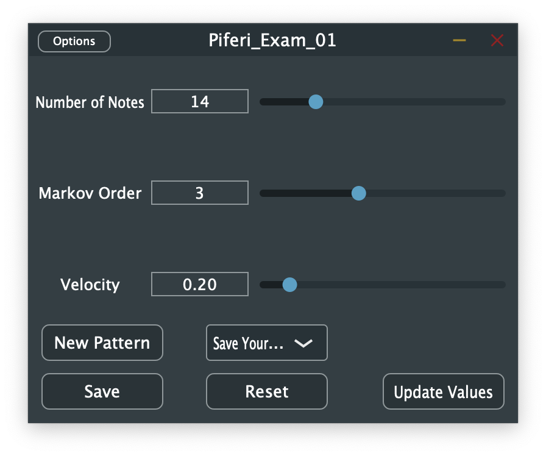

# MarkovMelody - An Automated Music Pattern Generator Using Markov Models

GitHub repository for the course _Selected Topics in Music and Acoustics Engineering_ at Politecnico di Milano

## Introduction
Automated music pattern generation is a burgeoning area of research that combines artificial intelligence and computer music composition. This article presents a novel system for creating music patterns using Markov Models, allowing for real-time playback via a built-in Sine Oscillator and MIDI export for use with virtual instruments. The system captures sequential dependencies within a given musical dataset and generates coherent yet diverse music patterns. Implemented in the JUCE framework, the system demonstrates its effectiveness in producing musical sequences and discusses potential applications in music composition and creative exploration.

  

## Markov Models - Definition
Markov Models were initially theorised by the Russian mathematician Andrey Markov (14 June 1856 – 20 July 1922). They are stochastic processes that undergo transitions from one state to another. Over the years, they have found countless applications, especially for modelling processes and informing decision making, in the fields of physics, queuing theory, statistics and music.

It is important to define the order of a Markov Model: it is the maximum number of samples that the chain can utilise in order to predict the following sample. For example, a first-order Markov Model will use only the last sample to predict the next one. A second-order Markov Model, will use the previous two samples and so on. A pure Markov Model, at the beginning would choose the initial state randomly. In this project the first state is fixed by the user by pressing a note in his MIDI keyboard. The following states are automatically generated following the transitions of the Markov Model.

## Markov Model - Music Generation
The dataset of this project is a long sequence of notes. From that sequence it is possible to extract the Model that will generate the new sequence.

The built-in dataset is _The Music Of The Night_, a song by Andrew Lloyd Webber from the musical _The Phantom Of The Opera_, but the user can decide to play a new song and use it to extract the Model.

Upon user activation of the built-in SineOscillator, the melody creation process is initiated, commencing from the pressed note. The subsequent note is then determined based on the sequential pattern derived from the model. Notably, the model is designed to optimize the Markov Order, striving to enhance the melodic coherence and musical structure of the generated sequence.

## MIDI Extraction
The generated note sequence can be exported as a MIDI file by selecting the desired sequence from the ComboBox. Upon selection, the sequence will be automatically saved as an `output.mid` file. This facilitates seamless integration with various external Digital Audio Workstations such as GarageBand, LogicProX, Ableton, and numerous others.

## Folder Structure
    src
    ├── Armonizer .h/.cpp
    ├── MarkovChain .h/.cpp
    ├── MarkovExperiment.cpp
    ├── MarkovManager .h/.cpp
    ├── PluginEditor .h/.cpp
    ├── PluginProcessor .h/.cpp
    ├── SineOscillator .h/.cpp
    └── resources
        └── images and report

## Author
* Piferi Francesco - francesco.piferi@mail.polimi.it

<i>For more details about this project and for a complete User Evaluation of it, please refer to the complete [**report**](./resources/STMAE_Piferi_Report.pdf)</i>

